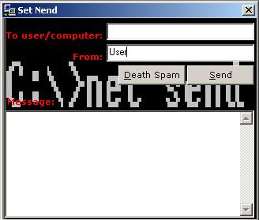



## Send console messages in NT/2000/XP \- & specify who it is from

### Description

This code demonstrates the use of the NETAPI32.dll to send a message to another user or computer on the network or to yourself if you are very bored!

The important difference between this code and other stuff you will find on the net is that it will let you specify who the message is from!

Also, the message can be sent across the internet, so long as the machine is running xp or nt and you know their IP.

This is only available to Windows NT 4, Windows 2000 and Windows XP home and pro editions.
 
### More Info
 

             |
---                |---
**Submitted On**   |2002-01-26 23:08:36
**By**             |[Sam North](https://github.com/Planet-Source-Code/PSCIndex/blob/master/ByAuthor/sam-north.md)
**Level**          |Intermediate
**User Rating**    |5.0 (15 globes from 3 users)
**Compatibility**  |VB 5\.0, VB 6\.0
**Category**       |[Windows System Services](https://github.com/Planet-Source-Code/PSCIndex/blob/master/ByCategory/windows-system-services__1-35.md)
**World**          |[Visual Basic](https://github.com/Planet-Source-Code/PSCIndex/blob/master/ByWorld/visual-basic.md)
**Archive File**   |[Send\_conso512671262002\.zip](https://github.com/Planet-Source-Code/sam-north-send-console-messages-in-nt-2000-xp-specify-who-it-is-from__1-31229/archive/master.zip)

